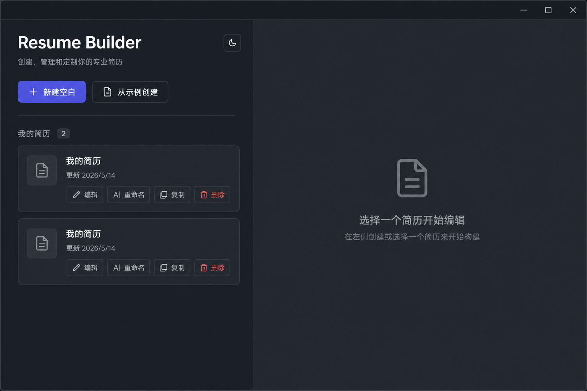
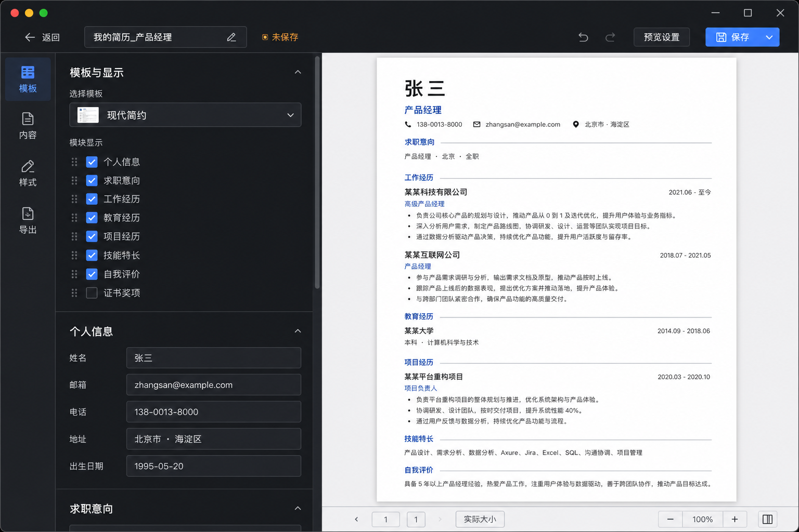

# Resume Builder

[](https://www.electronjs.org/)
[](https://react.dev/)
[](https://www.typescriptlang.org/)
[](https://pnpm.io/)
[](https://vitejs.dev/)
[]()
[](https://github.com/tagecode/resume-builder)
[](https://github.com/tagecode/resume-builder/stargazers)

一款跨平台桌面端个人简历编辑器：**本地优先、离线可用**，完成「多份简历管理 → 分区编辑 → 实时预览 → 导出 PDF」闭环。  
English: a cross-platform **Electron** app for structured resumes, live preview, and PDF export—data stays on disk.

## 截图

<table>
  <tr>
    <td align="center" width="50%">
      <b>简历列表</b><br/>
      
    </td>
    <td align="center" width="50%">
      <b>分栏编辑与实时预览</b><br/>
      
    </td>
  </tr>
</table>

> 上图为 README 展示用的风格化示意图；可替换为实机截图（见 [`docs/images/README.md`](docs/images/README.md)）。

## 功能概览

- **项目管理**：新建空白 / 从示例创建，重命名、复制、删除（删除二次确认）
- **结构化编辑**：个人信息、总结与意向、工作经历 / 教育 / 项目（条目可增删）、技能、证书与奖项、语言、自定义区块
- **模板与显隐**：3 套内置模板（经典 / 现代 / 极简）；模块显示或隐藏同步作用于预览与 PDF
- **保存**：防抖自动保存，**Ctrl/Cmd+S** 手动保存；返回列表时未保存变更可保存 / 放弃 / 取消
- **导出 PDF**：A4 / Letter、边距、清晰度（缩放）；预览与导出共用同一 HTML 管线

纯 Web 预览（`dev:web`）**无法**访问本机简历文件；完整能力请使用下方 **开发/打包** 的 Electron 方式。

## Roadmap

与 [`docs/prd.md`](docs/prd.md) §9 阶段规划对齐；**当前版本以 MVP（P0）为主流程可用**。

| 阶段 | 状态 | 方向（节选） |
|------|------|----------------|
| **MVP** | 基本完成 | 多简历、分区编辑、模板切换、显隐、自动/手动保存、PDF、本地 JSON 存储 |
| **V1.1** | 规划中 | 轻量富文本、区块拖拽排序、系统打印、JSON 备份/导入、原生菜单与快捷键、分页/溢出提示 |
| **V1.2** | 规划中 | 全局样式细化（字体/主题色/紧凑度等）、图片导出、最近打开与草稿恢复、拼写/字数、自动更新 |
| **更远期** | 待定 | 可选云同步、JSON Resume、自定义模板高级能力、分享与在线托管（见 PRD §6.9） |

实现细节与验收清单见 [`docs/mvp.md`](docs/mvp.md)。

## 技术栈

Electron · Vite · React 19 · TypeScript · Tailwind CSS v4 · shadcn 风格组件（Radix）· `electron-store`（主题等设置）

## 环境要求

- [Node.js](https://nodejs.org/)（建议 LTS）
- [pnpm](https://pnpm.io/)

## 快速开始

```bash
pnpm install
pnpm dev
```

使用默认浏览器打开终端里提示的本地地址即可调试；**编辑与导出简历**请在 Electron 窗口中操作（`pnpm dev` 会拉起桌面应用）。

其它常用命令：

| 命令 | 说明 |
|------|------|
| `pnpm dev` | 开发模式（Vite + Electron） |
| `pnpm dev:web` | 仅前端（无简历持久化，仅 UI 预览） |
| `pnpm build` | TypeScript 检查 + 渲染端与主进程构建 |
| `pnpm lint` | ESLint |
| `pnpm verify:mvp` | HTML 链路程式化冒烟（UTF-8、模块显隐、多模板差异） |
| `pnpm dist` / `pnpm dist:mac` / `dist:win` / `dist:linux` | 使用 electron-builder 打安装包，产物在 `release/` |

## 数据存储

每份简历为一份 JSON，默认路径：

`{Electron userData}/resumes/{resumeId}.json`

`userData` 随系统与用户目录变化（详见应用内列表页说明与 [`docs/mvp.md`](docs/mvp.md) §4）。**无需账号**；除你主动联网行为外，主流程不依赖网络。

## 文档

- [`docs/mvp.md`](docs/mvp.md)：MVP 范围与验收要点  
- [`docs/prd.md`](docs/prd.md)：产品需求与阶段规划（V1.1 等）

## 贡献与许可

欢迎 Issue / PR。本项目以 [**MIT License**](LICENSE) 发布，与 `package.json` 中的 `license` 字段一致。
